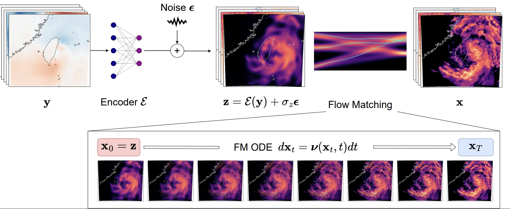

<!-- markdownlint-disable -->
## CorrDiff++: Adaptive Flow Matching for Resolving Small-Scale Physics

## Problem overview

Conditional diffusion and flow-based models have shown promise for super-resolving fine-scale structure in natural images. However, applying them to weather and physical domains introduces unique challenges:  
(i) spatial misalignment between input and target fields due to differing PDE resolutions,  
(ii) mismatched and heterogeneous input-output channels (i.e., channel synthesis), and  
(iii) channel-dependent stochasticity.

**CorrDiff** was proposed to address these issues but suffers from poor generalization—its regression-based residuals can overfit training data, leading to degraded performance on out-of-distribution inputs.

To overcome these limitations, **CorDiff++** was introduced at NVIDIA. It relies on adaptive floe matching (AFM) that improves upon CorrDiff in generalization, calibration, and efficiency through several key innovations:

- A joint encoder–generator architecture trained via flow matching  
- A latent base distribution that reconstructs the large-scale, deterministic signal  
- An adaptive noise scaling mechanism informed by the encoder’s RMSE, used to inject calibrated uncertainty  
- A final flow matching step to refine latent samples and synthesize fine-scale physical details

AFM outperforms previous methods across both real-world (e.g., 25 → 2 km super-resolution in Taiwan) and synthetic (Kolmogorov flow) benchmarks—especially for highly stochastic output channels.

📄 For details, see the [AFM paper (arXiv:2410.19814)](https://arxiv.org/abs/2410.19814).

<p align="center">

</p>

## Getting started

To build custom CorrDiff++ versions, you can get started by training the "Mini" version of CorrDiff++, which uses smaller training samples and a smaller network to reduce training costs from thousands of GPU hours to around 10 hours on A100 GPUs while still producing reasonable results. It also includes a simple data loader that can be used as a baseline for training CorrDiff++ on custom datasets. [@mohammad: the mini version nees to be created similar to corrdiff and needs to be tested]

### Preliminaries
Start by installing Modulus (if not already installed) and copying this folder (`examples/generative/corrdiff++`) to a system with a GPU available. Also download the CorrDiff++ dataset from [NGC](https://catalog.ngc.nvidia.com/orgs/nvidia/teams/modulus/resources/modulus_datasets-hrrr_mini).

### Configuration basics

Similar to its earlier version, CorrDiff++ training is handled by `train.py` and controlled by YAML configuration files handled by [Hydra](https://hydra.cc/docs/intro/). Prebuilt configuration files are found in the `conf` directory. You can choose the configuration file using the `--config-name` option. The main configuration file specifies the training dataset, the model configuration and the training options. The details of these are given in the corresponding configuration files. To change a configuration option, you can either edit the configuration files or use the Hydra command line overrides. For example, the training batch size is controlled by the option `training.hp.total_batch_size`. We can override this from the command line with the `++` syntax: `python train.py ++training.hp.total_batch_size=64` would set run the training with the batch size set to 64.

### Joint training of encoder and generator via flow matching

To train CorrDiff++, we use the main configuration file [config_train.yaml](/conf/config_training_sfm.yaml). This includes the following components:
To start the training, run:
```bash
python train.py --config-name=config_training_sfm.yaml ++dataset.data_path=</path/to/dataset>/hrrr_mini_train.nc ++dataset.stats_path=</path/to/dataset>/stats.json
```

The training will require a few hours on a single A100 GPU. If training is interrupted, it will automatically continue from the latest checkpoint when restarted. Multi-GPU and multi-node training are supported and will launch automatically when the training is run in a `torchrun` or MPI environment.

The results, including logs and checkpoints, are saved by default to `outputs/mini_generation/`. You can direct the checkpoints to be saved elsewhere by setting: `++training.io.checkpoint_dir=</path/to/checkpoints>`.

> **_Out of memory?_** CorrDiff-Mini trains by default with a batch size of 256 (set by `training.hp.total_batch_size`). If you're using a single GPU, especially one with a smaller amout of memory, you might see out-of-memory error. If that happens, set a smaller batch size per GPU, e.g.: `++training.hp.batch_size_per_gpu=16`. CorrDiff training will then automatically use gradient accumulation to train with an effective batch size of `training.hp.total_batch_size`.


### Generation

Use the `generate.py` script to generate samples with the trained networks:
```bash
python generate.py --config-name="config_generate_sfm.yaml" ++generation.io.res_ckpt_filename=</path/to/diffusion/model> ++generation.io.reg_ckpt_filename=</path/to/regression/model> ++generation.io.output_filename=</path/to/output/file>
```
where `</path/to/encoder/model>` and `</path/to/diffusion/model>` should point to the encoder and diffusion model checkpoints, respectively, and `</path/to/output/file>` indicates the output NetCDF4 file.

You can open the output file with e.g. the Python NetCDF4 library. The inputs are saved in the `input` group of the file, the ground truth data in the `truth` group, and the CorrDiff prediction in the `prediction` group.

## Configs

The `conf` directory contains the configuration files for the model, data,
training, etc. The configs are given in YAML format and use the `omegaconf`
library to manage them. Several example configs are given for training
different models that are encoder only, flow matching with pretrained encoder, and encoder with diffusion
models.
The default configs are set to train the encoder with diffusion model.
To train the other models, please adjust `conf/config_training.yaml`
according to the comments. Alternatively, you can create a new config file
and specify it using the `--config-name` option.


## Dataset & Datapipe

In this example, CorrDiff training is demonstrated on the Taiwan dataset,
conditioned on the [ERA5 dataset](https://www.ecmwf.int/en/forecasts/dataset/ecmwf-reanalysis-v5).
We have made this dataset available for non-commercial use under the
[CC BY-NC-ND 4.0 license](https://creativecommons.org/licenses/by-nc-nd/4.0/legalcode.en)
and can be downloaded from [https://catalog.ngc.nvidia.com/orgs/nvidia/teams/modulus/resources/modulus_datasets_cwa](https://catalog.ngc.nvidia.com/orgs/nvidia/teams/modulus/resources/modulus_datasets_cwa)
by `ngc registry resource download-version "nvidia/modulus/modulus_datasets_cwa:v1"`.
The datapipe in this example is tailored specifically for the Taiwan dataset.
A light-weight datapipe for the HRRR dataset is also available and can be used
with the CorrDiff++ model.
For other datasets, you will need to create a custom datapipe.
You can use the lightweight HRRR datapipe as a starting point for developing your new one.


### Sampling and Model Evaluation

Model evaluation is split into two components. `generate.py` creates a netCDF file
for the generated outputs, and `score_samples.py` computes deterministic and probablistic
scores.

To generate samples and save output in a netCDF file, run:

```bash
python generate.py
```
This will use the base configs specified in the `conf/config_generate.yaml` file.

Next, to score the generated samples, run:

```bash
python score_samples.py path=<PATH_TO_NC_FILE> output=<OUTPUT_FILE>
```

Some legacy plotting scripts are also available in the `inference` directory.
You can also bring your checkpoints to [earth2studio]<https://github.com/NVIDIA/earth2studio>
for further anaylysis and visualizations.

## Logging

We use TensorBoard for logging training and validation losses, as well as
the learning rate during training. To visualize TensorBoard running in a
Docker container on a remote server from your local desktop, follow these steps:

1. **Expose the Port in Docker:**
     Expose port 6006 in the Docker container by including
     `-p 6006:6006` in your docker run command.

2. **Launch TensorBoard:**
   Start TensorBoard within the Docker container:
     ```bash
     tensorboard --logdir=/path/to/logdir --port=6006
     ```

3. **Set Up SSH Tunneling:**
   Create an SSH tunnel to forward port 6006 from the remote server to your local machine:
     ```bash
     ssh -L 6006:localhost:6006 <user>@<remote-server-ip>
     ```
    Replace `<user>` with your SSH username and `<remote-server-ip>` with the IP address
    of your remote server. You can use a different port if necessary.

4. **Access TensorBoard:**
   Open your web browser and navigate to `http://localhost:6006` to view TensorBoard.

**Note:** Ensure the remote server’s firewall allows connections on port `6006`
and that your local machine’s firewall allows outgoing connections.


## References

- [Adaptive Flow Matching for Resolving Small-Scale Physics](https://openreview.net/forum?id=YJ1My9ttEN)
